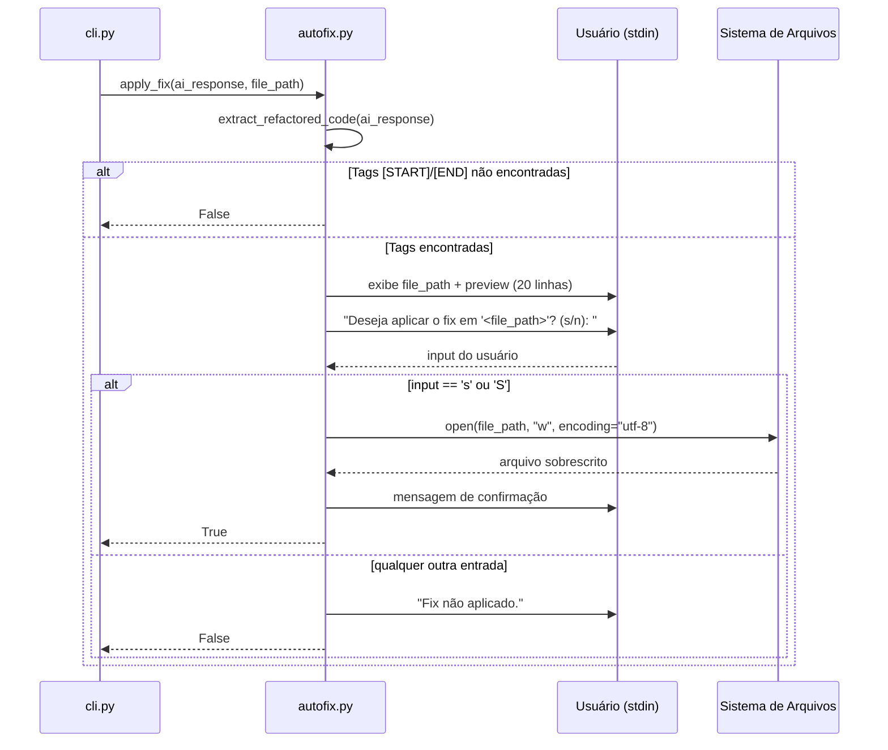

# Design Técnico: autofix-module

## Visão Geral

O `autofix.py` é um módulo utilitário do KiroSonar responsável por extrair o código refatorado da resposta da LLM e aplicá-lo ao arquivo original com confirmação explícita do usuário. Ele é completamente independente dos demais módulos — recebe dados prontos do orquestrador (`cli.py`) e não consome nenhuma outra dependência interna do projeto.

O módulo expõe duas funções públicas:

- `extract_refactored_code(ai_response)` — extrai o conteúdo entre as tags `[START]` e `[END]` via Regex.
- `apply_fix(ai_response, file_path)` — orquestra o preview, a confirmação interativa e a sobrescrita do arquivo.

Restrições técnicas:
- Apenas Standard Library Python (`re`, `os`)
- Python 3.11+
- PEP 8, Type Hinting obrigatório, Docstrings em todas as funções
- Encoding UTF-8 em todas as operações de escrita

---

## Arquitetura

O módulo segue uma arquitetura de funções puras e procedimentos simples, sem estado global nem classes. O fluxo de execução é linear:



### Decisões de Design

1. **Separação de responsabilidades**: `extract_refactored_code()` é uma função pura (sem efeitos colaterais) que pode ser testada isoladamente. `apply_fix()` orquestra os efeitos colaterais (I/O de terminal e arquivo).
2. **Regex com `re.DOTALL`**: a flag `DOTALL` é obrigatória para capturar código com múltiplas linhas entre as tags. O padrão `r'\[START\]\s*\n(.*?)\n\s*\[END\]'` usa `.*?` (non-greedy) para capturar apenas o primeiro bloco de código.
3. **Preview limitado a 20 linhas**: evita poluição do terminal para arquivos grandes, mantendo o feedback útil sem sobrecarregar o desenvolvedor.
4. **Confirmação case-insensitive**: aceitar `s` e `S` melhora a usabilidade sem adicionar complexidade.
5. **Sem rollback automático**: conforme o PRD (seção 11), o mecanismo de rollback é responsabilidade do desenvolvedor via `git checkout`. O módulo não implementa backup.

---

## Componentes e Interfaces

### `extract_refactored_code(ai_response: str) -> str | None`

Responsabilidade: parsear a resposta da LLM e retornar o código refatorado ou `None`.

```
Entrada : ai_response → str  (Markdown completo retornado pela LLM)
Saída   : str | None         (código extraído ou None se tags ausentes)
```

Algoritmo:
1. Aplicar `re.search(r'\[START\]\s*\n(.*?)\n\s*\[END\]', ai_response, re.DOTALL)`
2. Se `match`: retornar `match.group(1)`
3. Se não `match`: retornar `None`

### `apply_fix(ai_response: str, file_path: str) -> bool`

Responsabilidade: orquestrar extração, preview, confirmação e sobrescrita.

```
Entrada : ai_response → str  (Markdown completo retornado pela LLM)
          file_path   → str  (caminho do arquivo original a ser sobrescrito)
Saída   : bool               (True se aplicado, False caso contrário)
```

Algoritmo:
1. Chamar `extract_refactored_code(ai_response)` → `code`
2. Se `code is None`: imprimir aviso, retornar `False`
3. Gerar `preview = "\n".join(code.splitlines()[:20])`
4. Imprimir `file_path` e `preview` no terminal
5. Chamar `input(f"Deseja aplicar o fix em '{file_path}'? (s/n): ")` → `answer`
6. Se `answer.strip().lower() != "s"`: imprimir "Fix não aplicado.", retornar `False`
7. Abrir `file_path` em modo escrita com `encoding="utf-8"`, escrever `code`
8. Imprimir mensagem de confirmação, retornar `True`

---

## Modelos de Dados

O módulo não define classes nem estruturas de dados próprias. Os tipos envolvidos são primitivos Python:

| Símbolo | Tipo | Descrição |
|---|---|---|
| `ai_response` | `str` | Resposta Markdown completa da LLM, podendo conter `[START]...[END]` |
| `file_path` | `str` | Caminho do arquivo de código-fonte a ser sobrescrito |
| `refactored_code` | `str \| None` | Código extraído entre as tags, ou `None` se ausente |
| `preview` | `str` | Primeiras 20 linhas do `refactored_code` para exibição no terminal |
| `MOCK_AI_RESPONSE` | `str` | Constante Markdown para testes independentes da LLM |

### Padrão Regex

```python
PATTERN = r'\[START\]\s*\n(.*?)\n\s*\[END\]'
FLAGS    = re.DOTALL
```

- `\[START\]` — escapa os colchetes literais
- `\s*\n` — permite espaços opcionais antes da quebra de linha após a tag
- `(.*?)` — captura o código (non-greedy, grupo 1)
- `\n\s*\[END\]` — quebra de linha antes da tag de fechamento, com espaços opcionais

---

## Propriedades de Corretude

### Propriedade 1: Extração correta com tags presentes

*Para qualquer* `ai_response` que contenha `[START]\n<código>\n[END]`, `extract_refactored_code(ai_response)` deve retornar exatamente o conteúdo entre as tags, sem incluir as próprias tags.

**Validates: Requirements 1.1, 1.3**

---

### Propriedade 2: Retorno None sem tags

*Para qualquer* `ai_response` que não contenha simultaneamente `[START]` e `[END]`, `extract_refactored_code(ai_response)` deve retornar `None`.

**Validates: Requirements 1.2**

---

### Propriedade 3: apply_fix retorna False sem código refatorado

*Para qualquer* `ai_response` sem as tags `[START]`/`[END]` e qualquer `file_path`, `apply_fix(ai_response, file_path)` deve retornar `False` sem modificar nenhum arquivo no sistema de arquivos.

**Validates: Requirements 3.5, 5.3**

---

### Propriedade 4: Arquivo não modificado sem confirmação

*Para qualquer* `ai_response` com código refatorado e qualquer `file_path`, se o usuário fornecer qualquer entrada diferente de `s`/`S`, o arquivo em `file_path` não deve ser modificado e `apply_fix()` deve retornar `False`.

**Validates: Requirements 3.4, 5.2**

---

### Propriedade 5: Round-trip de conteúdo com confirmação

*Para qualquer* `refactored_code` válido, após `apply_fix()` com confirmação `s`, a leitura do arquivo em `file_path` com `encoding="utf-8"` deve retornar exatamente o `refactored_code` extraído.

**Validates: Requirements 4.1, 4.2**

---

## Tratamento de Erros

| Cenário | Comportamento esperado |
|---|---|
| `ai_response` sem tags `[START]`/`[END]` | `extract_refactored_code()` retorna `None`; `apply_fix()` imprime aviso e retorna `False` |
| `file_path` inexistente com confirmação `s` | `FileNotFoundError` propagado naturalmente pelo `open()` — não tratado no módulo |
| Sem permissão de escrita em `file_path` | `PermissionError` propagado ao orquestrador (`cli.py`) |
| Usuário digita entrada vazia no prompt | `answer.strip()` resulta em `""`, diferente de `"s"` — fix não aplicado, retorna `False` |

A estratégia de não capturar exceções de I/O é intencional: erros de permissão ou arquivo inexistente devem ser propagados ao orquestrador, que tem o contexto para exibir mensagens de erro ao usuário.

---

## Estratégia de Testes

### Arquivo de testes

`backend/tests/test_autofix.py`

### Testes Unitários para `extract_refactored_code`

- Exemplo concreto: `MOCK_AI_RESPONSE` → retorna o código correto
- Tags presentes com código multilinhas → retorna todas as linhas
- Sem tags → retorna `None`
- Tags presentes mas código vazio entre elas → retorna string vazia
- Apenas `[START]` sem `[END]` → retorna `None`

### Testes Unitários para `apply_fix`

Todos os testes de I/O devem usar `tmp_path` (fixture do pytest) para isolamento.

- Sem código refatorado → retorna `False`, arquivo não criado/modificado
- Com código, usuário digita `n` → retorna `False`, arquivo não modificado (mock de `input`)
- Com código, usuário digita `s` → retorna `True`, arquivo sobrescrito com conteúdo correto
- Com código, usuário digita `S` → retorna `True` (case-insensitive)
- Com código, usuário digita entrada vazia → retorna `False`
- Preview limitado a 20 linhas para código com mais de 20 linhas (capturar `stdout`)

### Isolamento

- Usar `monkeypatch` para mockar `builtins.input` nos testes de `apply_fix`
- Usar `tmp_path` para todos os testes que envolvem escrita de arquivo
- Usar `capsys` para verificar mensagens exibidas no terminal
