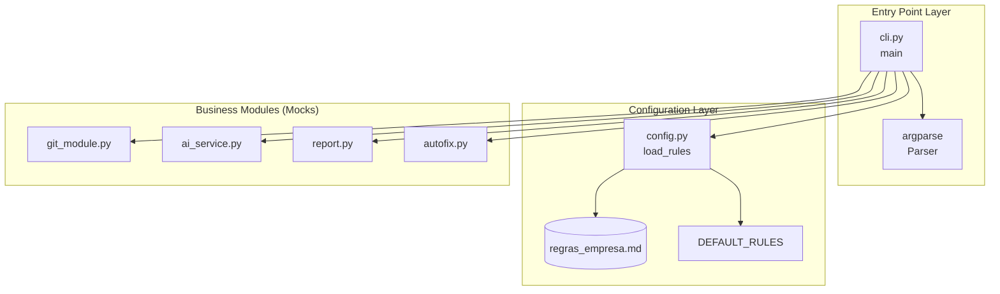
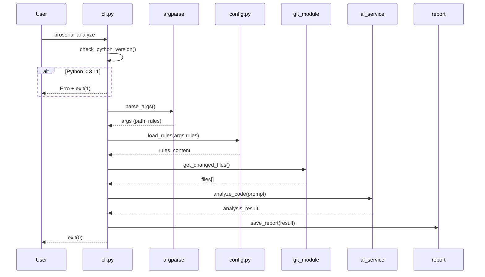

# Design Técnico: CLI Base

## Overview

Este documento descreve o design técnico da feature CLI Base do KiroSonar. A CLI serve como entry point da aplicação, responsável por:

1. Validar o ambiente de execução (Python >= 3.11)
2. Parsear argumentos da linha de comando via `argparse`
3. Carregar regras de análise de código (customizadas ou padrão)
4. Orquestrar a chamada aos módulos de análise

A arquitetura segue os princípios de Clean Architecture, mantendo o CLI como uma camada fina de orquestração que delega toda lógica de negócio aos módulos especializados.

## Architecture



### Fluxo de Execução



## Components and Interfaces

### 1. cli.py - Entry Point

**Responsabilidades:**
- Verificação de versão do Python (fail fast)
- Configuração do parser de argumentos
- Orquestração do fluxo de análise

**Interface Pública:**

```python
def main() -> None:
    """
    Entry point principal do KiroSonar.
    
    Lê argumentos de sys.argv, valida o ambiente e orquestra
    a execução dos módulos de análise.
    
    Returns:
        None. Encerra com exit(0) em sucesso ou exit(1) em erro.
    """
```

**Funções Internas:**

```python
def _check_python_version() -> None:
    """
    Verifica se a versão do Python é >= 3.11.
    
    Raises:
        SystemExit: Se a versão for inferior a 3.11.
    """

def _create_parser() -> argparse.ArgumentParser:
    """
    Cria e configura o parser de argumentos.
    
    Returns:
        ArgumentParser configurado com subcomando 'analyze'.
    """

def _run_analyze(args: argparse.Namespace) -> None:
    """
    Executa o fluxo de análise de código.
    
    Args:
        args: Namespace com os argumentos parseados.
    
    Raises:
        SystemExit: Se ocorrer erro durante a análise.
    """
```

### 2. config.py - Configuration Loader

**Responsabilidades:**
- Carregar regras de análise de arquivos .md
- Fornecer regras padrão como fallback

**Interface Pública:**

```python
DEFAULT_RULES: str = """
# Regras Padrão de Análise - KiroSonar
...
"""

def load_rules(rules_path: str | None = None) -> str:
    """
    Carrega as regras de análise de um arquivo .md.
    
    Args:
        rules_path: Caminho para arquivo de regras customizadas.
                   Se None, busca 'regras_empresa.md' no diretório atual.
    
    Returns:
        Conteúdo das regras como string (nunca vazio).
        Retorna DEFAULT_RULES se o arquivo não existir.
    """
```

### 3. Módulos Consumidos (Mocks)

| Módulo | Função | Assinatura | Mock Behavior |
|--------|--------|------------|---------------|
| `git_module.py` | `get_changed_files()` | `() -> list[str]` | Retorna `["src/exemplo.py"]` |
| `ai_service.py` | `analyze_code(prompt)` | `(str) -> str` | Retorna Markdown fixo |
| `report.py` | `save_report(content, path)` | `(str, str) -> None` | Print no console |
| `autofix.py` | `apply_fix(ai_response, file)` | `(str, str) -> None` | Print no console |

## Data Models

### Argumentos do CLI

```python
@dataclass
class AnalyzeArgs:
    """Argumentos parseados do subcomando analyze."""
    path: str | None  # Caminho do arquivo a analisar
    rules: str | None  # Caminho do arquivo de regras
```

### Estrutura do Parser

```
kirosonar
├── --help          # Exibe ajuda geral
└── analyze         # Subcomando de análise
    ├── --help      # Exibe ajuda do analyze
    ├── --path      # Arquivo específico (opcional)
    └── --rules     # Arquivo de regras (opcional)
```

### Códigos de Saída

| Código | Significado |
|--------|-------------|
| 0 | Execução bem-sucedida |
| 1 | Erro (versão Python, arquivo não encontrado, exceção) |

### Constante DEFAULT_RULES

```markdown
# Regras Padrão de Análise - KiroSonar

## Princípios SOLID
- Single Responsibility: Cada classe/função deve ter uma única responsabilidade
- Open/Closed: Aberto para extensão, fechado para modificação
- Liskov Substitution: Subtipos devem ser substituíveis por seus tipos base
- Interface Segregation: Interfaces específicas são melhores que uma geral
- Dependency Inversion: Dependa de abstrações, não de implementações

## Convenções de Nomenclatura
- Classes: PascalCase
- Funções e variáveis: snake_case
- Constantes: UPPER_SNAKE_CASE
- Módulos: snake_case

## Complexidade
- Funções com mais de 20 linhas devem ser refatoradas
- Complexidade ciclomática máxima: 10
- Máximo de 3 níveis de indentação

## Type Hints
- Todas as funções públicas devem ter type hints
- Usar tipos do módulo typing quando necessário

## Princípio DRY
- Evitar duplicação de código
- Extrair lógica comum para funções/classes reutilizáveis

## Docstrings
- Todas as funções públicas devem ter docstrings
- Formato: Google Style ou NumPy Style
```


## Correctness Properties

*Uma propriedade é uma característica ou comportamento que deve ser verdadeiro em todas as execuções válidas de um sistema — essencialmente, uma declaração formal sobre o que o sistema deve fazer. Propriedades servem como ponte entre especificações legíveis por humanos e garantias de correção verificáveis por máquina.*

### Property 1: Verificação de Versão Python

*Para qualquer* versão de Python, se a versão for >= 3.11, a função de verificação deve permitir a execução continuar; se a versão for < 3.11, deve exibir mensagem de erro contendo a versão atual e encerrar com código 1.

**Validates: Requirements 2.1, 2.2, 2.3**

### Property 2: Tratamento de Caminhos Inválidos no --path

*Para qualquer* caminho fornecido na flag `--path` que não existe no sistema de arquivos, o CLI deve exibir mensagem de erro descritiva e encerrar com código de saída 1.

**Validates: Requirements 4.6**

### Property 3: Round-trip de load_rules com UTF-8

*Para qualquer* conteúdo de texto válido em UTF-8 (incluindo caracteres especiais, acentos e emojis) escrito em um arquivo, quando `load_rules(caminho)` é chamada com esse caminho, deve retornar exatamente o mesmo conteúdo.

**Validates: Requirements 6.3, 6.5**

### Property 4: Fallback para DEFAULT_RULES em Caminhos Inválidos

*Para qualquer* caminho inválido ou inexistente fornecido a `load_rules(rules_path)`, a função deve retornar o conteúdo de DEFAULT_RULES ao invés de lançar exceção.

**Validates: Requirements 6.4**

### Property 5: load_rules Nunca Retorna String Vazia

*Para qualquer* chamada válida a `load_rules()` (com ou sem argumento), o retorno deve ser uma string não vazia.

**Validates: Requirements 9.3**

### Property 6: Tratamento de Exceções dos Módulos

*Para qualquer* exceção lançada por qualquer módulo consumido (git_module, ai_service, report, autofix), o Entry_Point deve capturar a exceção, exibir mensagem amigável ao usuário e encerrar com código de saída 1.

**Validates: Requirements 5.4**

## Error Handling

### Estratégia de Tratamento de Erros

O CLI segue o padrão "Fail Fast" com mensagens amigáveis:

```python
# Hierarquia de erros
class KiroSonarError(Exception):
    """Exceção base para erros do KiroSonar."""
    pass

class VersionError(KiroSonarError):
    """Versão do Python incompatível."""
    pass

class FileNotFoundError(KiroSonarError):
    """Arquivo especificado não encontrado."""
    pass

class ModuleError(KiroSonarError):
    """Erro em módulo consumido."""
    pass
```

### Cenários de Erro

| Cenário | Mensagem | Código de Saída |
|---------|----------|-----------------|
| Python < 3.11 | "Erro: KiroSonar requer Python 3.11 ou superior. Versão atual: {versão}" | 1 |
| Arquivo --path não existe | "Erro: Arquivo não encontrado: {caminho}" | 1 |
| Erro em módulo consumido | "Erro: {descrição amigável do erro}" | 1 |
| Erro de leitura de arquivo | Fallback silencioso para DEFAULT_RULES | N/A |

### Padrão de Implementação

```python
def main() -> None:
    try:
        _check_python_version()
        args = _create_parser().parse_args()
        _run_analyze(args)
    except SystemExit:
        raise  # Propaga exit codes
    except Exception as e:
        print(f"Erro: {e}", file=sys.stderr)
        sys.exit(1)
```

## Testing Strategy

### Abordagem Dual de Testes

A estratégia de testes combina testes unitários e testes baseados em propriedades:

- **Testes Unitários**: Verificam exemplos específicos, edge cases e condições de erro
- **Testes de Propriedade**: Verificam propriedades universais em múltiplas entradas geradas

### Biblioteca de Property-Based Testing

**Biblioteca escolhida:** `hypothesis` (padrão para Python)

```toml
[project.optional-dependencies]
test = ["pytest", "hypothesis"]
```

### Configuração dos Testes de Propriedade

- Mínimo de 100 iterações por teste de propriedade
- Cada teste deve referenciar a propriedade do design
- Formato de tag: `# Feature: cli-base, Property {número}: {descrição}`

### Estrutura de Testes

```
backend/tests/
├── __init__.py
├── test_cli.py           # Testes do entry point
├── test_config.py        # Testes do config loader
└── conftest.py           # Fixtures compartilhadas
```

### Mapeamento de Testes

| Propriedade | Tipo de Teste | Arquivo |
|-------------|---------------|---------|
| Property 1: Verificação de Versão | Property + Unit | test_cli.py |
| Property 2: Caminhos Inválidos | Property | test_cli.py |
| Property 3: Round-trip UTF-8 | Property | test_config.py |
| Property 4: Fallback DEFAULT_RULES | Property | test_config.py |
| Property 5: Retorno Não Vazio | Property | test_config.py |
| Property 6: Tratamento de Exceções | Property | test_cli.py |

### Exemplos de Testes

#### Teste de Propriedade - load_rules Round-trip (Property 3)

```python
from hypothesis import given, strategies as st, settings

# Feature: cli-base, Property 3: Round-trip de load_rules com UTF-8
@given(st.text(min_size=1))
@settings(max_examples=100)
def test_load_rules_roundtrip(tmp_path, content):
    """Para qualquer conteúdo UTF-8, load_rules deve retornar o mesmo conteúdo."""
    rules_file = tmp_path / "rules.md"
    rules_file.write_text(content, encoding="utf-8")
    
    result = load_rules(str(rules_file))
    
    assert result == content
```

#### Teste de Propriedade - Retorno Não Vazio (Property 5)

```python
# Feature: cli-base, Property 5: load_rules nunca retorna string vazia
@given(st.one_of(st.none(), st.text()))
@settings(max_examples=100)
def test_load_rules_never_empty(tmp_path, rules_path):
    """Para qualquer chamada válida, load_rules retorna string não vazia."""
    if rules_path is not None:
        # Cria arquivo se path fornecido
        rules_file = tmp_path / "rules.md"
        rules_file.write_text("# Rules", encoding="utf-8")
        rules_path = str(rules_file)
    
    result = load_rules(rules_path)
    
    assert result  # String não vazia
    assert len(result) > 0
```

#### Teste Unitário - Help Display (Exemplo)

```python
def test_cli_without_args_shows_help(capsys):
    """Verifica que CLI sem argumentos exibe ajuda."""
    with pytest.raises(SystemExit) as exc_info:
        main()
    
    captured = capsys.readouterr()
    assert "usage:" in captured.out.lower()
    assert "analyze" in captured.out
```

### Cobertura Esperada

- Cobertura de linha: >= 90%
- Cobertura de branch: >= 85%
- Todas as propriedades devem ter testes correspondentes
