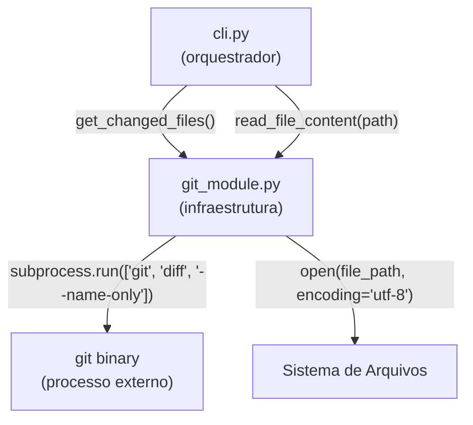

# Design Document — git-diff-module

## Overview

O `git_module.py` é a camada de infraestrutura do KiroSonar responsável por duas operações distintas e independentes:

1. **Detecção de arquivos alterados**: executa `git diff --name-only` via `subprocess` e retorna a lista de caminhos relativos dos arquivos modificados no working tree.
2. **Leitura de conteúdo de arquivo**: lê o conteúdo completo de um arquivo em UTF-8 para envio à LLM.

O módulo não possui dependências externas — utiliza exclusivamente `subprocess`, `sys` e `os` da Standard Library do Python. É consumido diretamente pelo `cli.py` como parte do fluxo principal de análise do KiroSonar.

```
kirosonar analyze
    → get_changed_files()       # detecta arquivos via git diff
    → read_file_content(path)   # lê conteúdo de cada arquivo
    → prompt_builder / ai_service / report
```

---

## Architecture

O módulo segue uma arquitetura de **infraestrutura pura** — sem estado, sem classes, sem dependências externas. Todas as funções são stateless e determinísticas dado o mesmo ambiente de execução.



**Decisões de design:**

- **Sem classes**: o módulo expõe apenas funções de nível de módulo. A simplicidade é intencional — não há estado a encapsular.
- **Falha rápida (fail-fast)**: `get_changed_files()` encerra o processo imediatamente com `sys.exit(1)` se não estiver em um repositório Git válido, evitando propagação de erros para camadas superiores.
- **Propagação de exceção**: `read_file_content()` não captura `FileNotFoundError` — a responsabilidade de tratar arquivos inexistentes é do chamador (`cli.py`).
- **Standard Library only**: sem dependências externas, alinhado ao requisito 3.3 e ao `pyproject.toml` do projeto.

---

## Components and Interfaces

### `get_changed_files() -> list[str]`

Executa `git diff --name-only` e retorna a lista de caminhos relativos dos arquivos modificados.

**Contrato:**
- Input: nenhum (lê o estado do working tree via subprocess)
- Output: `list[str]` — caminhos relativos, sem strings vazias, sem whitespace nas bordas
- Side effects: imprime mensagem de erro e chama `sys.exit(1)` se `returncode != 0`

**Fluxo interno:**
```
subprocess.run(["git", "diff", "--name-only"], capture_output=True, text=True)
    → returncode != 0  →  print(erro) + sys.exit(1)
    → returncode == 0  →  splitlines() → filter(strip) → return list
```

### `read_file_content(file_path: str) -> str`

Lê e retorna o conteúdo completo de um arquivo em UTF-8.

**Contrato:**
- Input: `file_path: str` — caminho relativo ou absoluto
- Output: `str` — conteúdo completo do arquivo
- Raises: `FileNotFoundError` se o arquivo não existir (propagada sem captura)

---

## Data Models

O módulo não define tipos de dados próprios. Os tipos utilizados são primitivos da Standard Library:

| Símbolo | Tipo Python | Descrição |
|---|---|---|
| `file_path` | `str` | Caminho relativo ou absoluto de um arquivo |
| `changed_files` | `list[str]` | Lista de caminhos relativos retornada por `get_changed_files()` |
| `content` | `str` | Conteúdo completo de um arquivo, encoding UTF-8 |

**Invariantes dos dados:**
- Cada elemento de `changed_files` é uma string não-vazia e sem whitespace nas extremidades.
- `content` é sempre uma string válida UTF-8 (garantido pelo `open(..., encoding="utf-8")`).

---

## Correctness Properties

*A property is a characteristic or behavior that should hold true across all valid executions of a system — essentially, a formal statement about what the system should do. Properties serve as the bridge between human-readable specifications and machine-verifiable correctness guarantees.*

### Property 1: Output parsing preserva apenas entradas válidas

*Para qualquer* output do subprocess `git diff --name-only` contendo N linhas não-vazias e não-whitespace, `get_changed_files()` deve retornar uma lista com exatamente essas N strings, sem strings vazias e sem whitespace nas extremidades de cada entrada.

**Validates: Requirements 1.1, 1.4, 1.5**

### Property 2: Returncode não-zero sempre resulta em SystemExit(1)

*Para qualquer* returncode diferente de zero retornado pelo subprocess, `get_changed_files()` deve encerrar o processo com `SystemExit` de código `1`, independentemente do valor específico do returncode ou do conteúdo de stderr.

**Validates: Requirements 1.3**

### Property 3: Leitura de arquivo é round-trip fiel

*Para qualquer* string de conteúdo válida em UTF-8, se esse conteúdo for escrito em um arquivo temporário e `read_file_content()` for invocada com o caminho desse arquivo, o valor retornado deve ser idêntico ao conteúdo original.

**Validates: Requirements 2.1**

### Property 4: Equivalência entre caminhos relativos e absolutos

*Para qualquer* arquivo existente no sistema de arquivos, `read_file_content()` deve retornar o mesmo conteúdo independentemente de o caminho fornecido ser relativo ou absoluto.

**Validates: Requirements 2.3**

---

## Error Handling

| Situação | Comportamento | Requisito |
|---|---|---|
| `git diff` retorna `returncode != 0` | Imprime `"Erro: O diretório atual não é um repositório Git."` e chama `sys.exit(1)` | 1.3 |
| `read_file_content()` com arquivo inexistente | Propaga `FileNotFoundError` sem capturar | 2.2 |
| Output do `git diff` com linhas vazias | Filtradas antes de retornar a lista | 1.4 |
| Output do `git diff` com whitespace nas bordas | Removido via `strip()` em cada linha | 1.5 |

**Decisão de design — fail-fast vs propagação:**
- `get_changed_files()` usa fail-fast (`sys.exit`) porque um diretório não-Git é um pré-requisito irrecuperável para toda a execução do KiroSonar.
- `read_file_content()` propaga a exceção porque o chamador (`cli.py`) pode ter lógica de recuperação (ex: pular o arquivo e continuar com os demais).

---

## Testing Strategy

### Abordagem dual: testes unitários + testes baseados em propriedades

Os testes unitários cobrem exemplos concretos e casos de borda. Os testes de propriedade verificam invariantes universais com entradas geradas aleatoriamente. Ambos são complementares e necessários.

**Biblioteca de property-based testing:** [`hypothesis`](https://hypothesis.readthedocs.io/) — biblioteca padrão do ecossistema Python para PBT, madura e amplamente adotada.

**Configuração:** cada teste de propriedade deve rodar com mínimo de 100 iterações (`settings(max_examples=100)`).

**Tag format:** cada teste de propriedade deve conter um comentário de rastreabilidade:
`# Feature: git-diff-module, Property {N}: {texto da propriedade}`

---

### Testes Unitários (`backend/tests/test_git_module.py`)

**`get_changed_files()`**
- Retorna lista correta de arquivos quando subprocess tem output com múltiplos arquivos
- Retorna lista vazia quando subprocess retorna stdout vazio (nenhum arquivo alterado)
- Filtra linhas vazias do output do subprocess
- Chama `sys.exit(1)` quando `returncode != 0`
- Invoca subprocess com os argumentos corretos: `["git", "diff", "--name-only"]`, `capture_output=True`, `text=True`

**`read_file_content()`**
- Retorna conteúdo completo de arquivo existente
- Levanta `FileNotFoundError` para arquivo inexistente
- Abre o arquivo com `encoding="utf-8"`

---

### Testes de Propriedade (`backend/tests/test_git_module_properties.py`)

Cada propriedade do design deve ser implementada por um único teste de propriedade:

**Property 1 — Output parsing preserva apenas entradas válidas**
```
# Feature: git-diff-module, Property 1: Output parsing preserva apenas entradas válidas
@given(st.lists(st.text(min_size=1).filter(lambda s: s.strip()), min_size=0))
@settings(max_examples=100)
def test_get_changed_files_output_parsing(file_names):
    # Mockar subprocess com output = "\n".join(file_names) + linhas vazias intercaladas
    # Verificar: resultado não contém strings vazias, cada entrada está stripped
```

**Property 2 — Returncode não-zero sempre resulta em SystemExit(1)**
```
# Feature: git-diff-module, Property 2: Returncode não-zero sempre resulta em SystemExit(1)
@given(st.integers(min_value=1, max_value=255))
@settings(max_examples=100)
def test_non_zero_returncode_exits(returncode):
    # Mockar subprocess com returncode=returncode
    # Verificar: SystemExit com código 1
```

**Property 3 — Leitura de arquivo é round-trip fiel**
```
# Feature: git-diff-module, Property 3: Leitura de arquivo é round-trip fiel
@given(st.text())
@settings(max_examples=100)
def test_read_file_content_round_trip(content):
    # Escrever content em arquivo temporário (tmp_path)
    # Verificar: read_file_content(path) == content
```

**Property 4 — Equivalência entre caminhos relativos e absolutos**
```
# Feature: git-diff-module, Property 4: Equivalência entre caminhos relativos e absolutos
@given(st.text())
@settings(max_examples=100)
def test_relative_absolute_path_equivalence(content):
    # Escrever content em arquivo temporário
    # Verificar: read_file_content(relativo) == read_file_content(absoluto)
```

---

### Cobertura esperada

| Critério | Tipo de teste | Propriedade |
|---|---|---|
| 1.1 Retorna lista de arquivos modificados | Property | P1 |
| 1.2 Retorna lista vazia sem modificações | Unit (edge-case de P1) | P1 |
| 1.3 sys.exit(1) em returncode != 0 | Property | P2 |
| 1.4 Filtra linhas vazias | Property | P1 |
| 1.5 Strip de whitespace nas bordas | Property | P1 |
| 2.1 Retorna conteúdo completo em UTF-8 | Property | P3 |
| 2.2 Propaga FileNotFoundError | Unit (edge-case) | — |
| 2.3 Aceita caminhos relativos e absolutos | Property | P4 |
| 3.1–3.4 Conformidade de código | Análise estática (mypy, ruff) | — |
