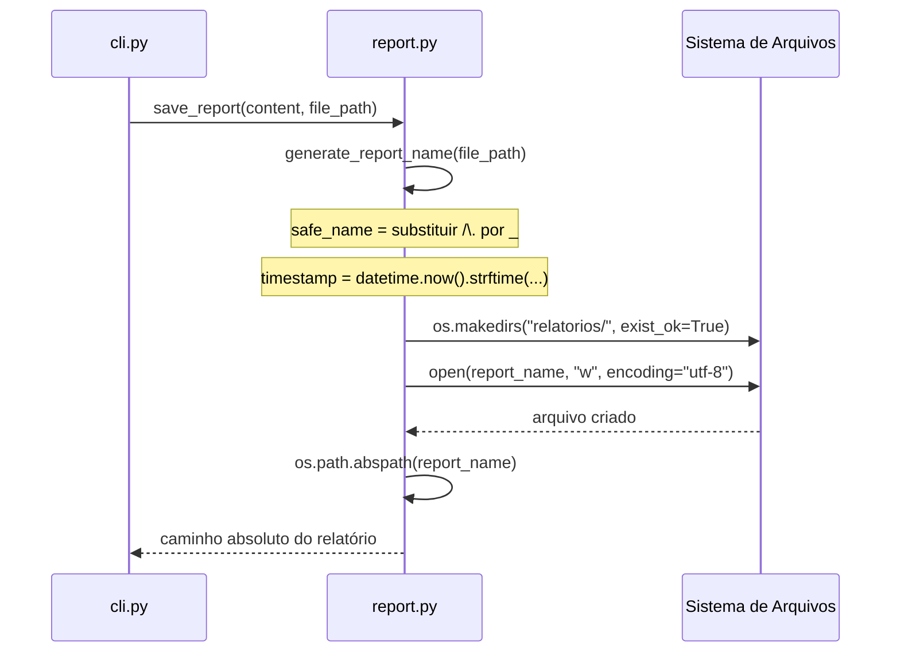

# Design Técnico: report-module

## Visão Geral

O `report.py` é um módulo utilitário do KiroSonar responsável por persistir o relatório gerado pela LLM como arquivo Markdown na pasta `relatorios/`. Ele é completamente independente dos demais módulos — recebe dados prontos do orquestrador (`cli.py`) e não consome nenhuma outra dependência interna do projeto.

O módulo expõe duas funções públicas:

- `generate_report_name(file_path)` — gera um nome de arquivo único com base no caminho do arquivo analisado e um timestamp.
- `save_report(content, file_path)` — orquestra a criação do diretório, a escrita do arquivo e o retorno do caminho absoluto.

Restrições técnicas:
- Apenas Standard Library Python (`os`, `datetime`)
- Python 3.11+
- PEP 8, Type Hinting obrigatório, Docstrings em todas as funções
- Encoding UTF-8 em todas as operações de escrita

---

## Arquitetura

O módulo segue uma arquitetura de funções puras e procedimentos simples, sem estado global nem classes. O fluxo de execução é linear:



### Decisões de Design

1. **Sem estado global**: as funções são stateless — cada chamada é independente. Isso facilita testes e evita efeitos colaterais.
2. **`exist_ok=True` no makedirs**: garante idempotência na criação do diretório, eliminando a necessidade de verificação prévia.
3. **Timestamp no nome do arquivo**: garante unicidade mesmo para o mesmo `file_path` chamado em sequência rápida (resolução de segundos).
4. **Retorno do caminho absoluto**: desacopla o chamador de qualquer suposição sobre o diretório de trabalho atual.
5. **`print()` para feedback**: o módulo imprime o caminho salvo em `stdout` conforme Requisito 6, mantendo o feedback simples sem dependência de logging.

---

## Componentes e Interfaces

### `generate_report_name(file_path: str) -> str`

Responsabilidade: produzir um nome de arquivo determinístico (dado o instante de chamada) e seguro para o sistema de arquivos.

```
Entrada : file_path  → str  (ex: "src/app.py", "backend\src\main.py")
Saída   : str              (ex: "relatorios/src_app_py_20260318_173000.md")
```

Algoritmo:
1. Substituir `os.sep`, `/` e `.` por `_` → `safe_name`
2. Capturar `datetime.now().strftime("%Y%m%d_%H%M%S")` → `timestamp`
3. Retornar `os.path.join("relatorios", f"{safe_name}_{timestamp}.md")`

### `save_report(content: str, file_path: str) -> str`

Responsabilidade: orquestrar a persistência do relatório e retornar o caminho absoluto.

```
Entrada : content    → str  (Markdown retornado pela LLM)
          file_path  → str  (caminho do arquivo analisado)
Saída   : str              (caminho absoluto do arquivo salvo)
```

Algoritmo:
1. Chamar `generate_report_name(file_path)` → `report_name`
2. `os.makedirs(os.path.dirname(report_name), exist_ok=True)`
3. Abrir `report_name` em modo escrita com `encoding="utf-8"`
4. Escrever `content`
5. Imprimir caminho absoluto em `stdout`
6. Retornar `os.path.abspath(report_name)`

---

## Modelos de Dados

O módulo não define classes nem estruturas de dados próprias. Os tipos envolvidos são primitivos Python:

| Símbolo | Tipo | Descrição |
|---|---|---|
| `file_path` | `str` | Caminho do arquivo de código-fonte analisado (ex: `src/app.py`) |
| `safe_name` | `str` | `file_path` com `/`, `\` e `.` substituídos por `_` |
| `timestamp` | `str` | String `YYYYMMDD_HHMMSS` gerada no momento da chamada |
| `report_name` | `str` | Caminho relativo do relatório: `relatorios/<safe_name>_<timestamp>.md` |
| `content` | `str` | Conteúdo Markdown do relatório gerado pela LLM |
| `MOCK_CONTENT` | `str` | Constante Markdown para testes independentes da LLM |

### Formato do nome do arquivo

```
relatorios/<safe_name>_<timestamp>.md

Exemplos:
  file_path = "src/app.py"       → relatorios/src_app_py_20260318_173000.md
  file_path = "backend/src/x.py" → relatorios/backend_src_x_py_20260318_173001.md
  file_path = "main.py"          → relatorios/main_py_20260318_173002.md
```


---

## Propriedades de Corretude

*Uma propriedade é uma característica ou comportamento que deve ser verdadeiro em todas as execuções válidas de um sistema — essencialmente, uma declaração formal sobre o que o sistema deve fazer. Propriedades servem como ponte entre especificações legíveis por humanos e garantias de corretude verificáveis por máquina.*

### Propriedade 1: Formato do nome gerado

*Para qualquer* `file_path` válido, o resultado de `generate_report_name(file_path)` deve começar com `"relatorios/"`, terminar com `".md"` e conter uma substring que corresponda ao padrão `\d{8}_\d{6}` (timestamp `YYYYMMDD_HHMMSS`).

**Validates: Requirements 1.1, 1.4**

---

### Propriedade 2: Sanitização do safe_name

*Para qualquer* string `file_path`, o nome gerado por `generate_report_name(file_path)` não deve conter os caracteres `/`, `\` nem `.` na parte do `safe_name` (antes do timestamp e da extensão `.md`).

**Validates: Requirements 1.2, 1.3**

---

### Propriedade 3: Diretório criado automaticamente

*Para qualquer* `content` e `file_path`, após a chamada de `save_report(content, file_path)` em um diretório temporário onde `relatorios/` não existia, o diretório `relatorios/` deve existir no sistema de arquivos.

**Validates: Requirements 2.1, 2.2**

---

### Propriedade 4: Round-trip de conteúdo com suporte a Unicode

*Para qualquer* string `content` (incluindo strings com acentos, cedilha e outros caracteres Unicode), após `save_report(content, file_path)`, a leitura do arquivo salvo com `encoding="utf-8"` deve retornar exatamente o mesmo `content` original.

**Validates: Requirements 3.1, 3.2, 3.3**

---

### Propriedade 5: Retorno é caminho absoluto existente

*Para qualquer* `content` e `file_path`, o valor retornado por `save_report(content, file_path)` deve ser um caminho absoluto (`os.path.isabs` retorna `True`) que aponta para um arquivo existente no sistema de arquivos (`os.path.exists` retorna `True`).

**Validates: Requirements 4.1, 4.2**

---

### Propriedade 6: file_paths distintos geram nomes distintos

*Para quaisquer* dois `file_path` distintos (`fp1 != fp2`), `generate_report_name(fp1)` e `generate_report_name(fp2)` devem retornar nomes de arquivo diferentes (desconsiderando o timestamp, o `safe_name` já os diferencia).

**Validates: Requirements 5.1**

---

### Propriedade 7: stdout contém o caminho absoluto

*Para qualquer* `content` e `file_path`, após `save_report(content, file_path)`, a saída padrão (`stdout`) deve conter o caminho absoluto do arquivo salvo.

**Validates: Requirements 6.1**

---

## Tratamento de Erros

O módulo opera com Standard Library e não lança exceções próprias. Os cenários de erro relevantes são:

| Cenário | Comportamento esperado |
|---|---|
| `file_path` é string vazia `""` | `safe_name` será `""`, gerando `relatorios/__<timestamp>.md` — comportamento definido, sem exceção |
| Sem permissão de escrita no diretório | `PermissionError` propagado naturalmente pelo `open()` — não é tratado no módulo |
| `content` é string vazia `""` | Arquivo `.md` criado com conteúdo vazio — comportamento válido |
| `relatorios/` já existe | `exist_ok=True` garante que nenhuma exceção é lançada (Requisito 2.2) |

A estratégia de não capturar exceções de I/O é intencional: erros de permissão ou disco cheio devem ser propagados ao orquestrador (`cli.py`), que tem o contexto para exibir mensagens de erro ao usuário.

---

## Estratégia de Testes

### Abordagem Dual

Os testes do `report-module` combinam testes unitários (exemplos específicos e casos de borda) com testes baseados em propriedades (cobertura universal de inputs).

**Arquivo de testes:** `backend/tests/test_report.py`

### Testes Unitários

Focados em exemplos concretos e casos de borda:

- Exemplo: `generate_report_name("src/app.py")` retorna string no formato esperado
- Exemplo: `save_report()` chamado duas vezes com o mesmo `file_path` em instantes distintos (mock de `datetime`) gera nomes diferentes (Requisito 1.5, 5.2)
- Edge case: `save_report()` chamado com `relatorios/` já existente não lança exceção (Requisito 2.2)
- Edge case: `content` com string vazia cria arquivo vazio sem erro
- Integração: `save_report()` com `MOCK_CONTENT` sem importar nenhum outro módulo do KiroSonar

### Testes Baseados em Propriedades

Biblioteca: **Hypothesis** (`pip install hypothesis`)

Cada propriedade do design deve ser implementada como um único teste de propriedade com mínimo de 100 iterações (padrão do Hypothesis).

Formato de tag obrigatório em cada teste:

```
# Feature: report-module, Property <N>: <texto da propriedade>
```

| Propriedade | Teste | Tag |
|---|---|---|
| P1: Formato do nome gerado | `@given(st.text(min_size=1))` verifica prefixo, sufixo e regex do timestamp | `Feature: report-module, Property 1` |
| P2: Sanitização do safe_name | `@given(st.text())` verifica ausência de `/`, `\`, `.` no safe_name | `Feature: report-module, Property 2` |
| P3: Diretório criado automaticamente | `@given(st.text(), st.text(min_size=1))` em `tmp_path` verifica existência de `relatorios/` | `Feature: report-module, Property 3` |
| P4: Round-trip de conteúdo com Unicode | `@given(st.text())` escreve e lê o arquivo, compara conteúdo | `Feature: report-module, Property 4` |
| P5: Retorno é caminho absoluto existente | `@given(st.text(), st.text(min_size=1))` verifica `isabs` e `exists` | `Feature: report-module, Property 5` |
| P6: file_paths distintos geram nomes distintos | `@given(st.text(), st.text())` com `assume(fp1 != fp2)` verifica nomes diferentes | `Feature: report-module, Property 6` |
| P7: stdout contém caminho absoluto | `@given(st.text(), st.text(min_size=1))` captura stdout e verifica presença do caminho | `Feature: report-module, Property 7` |

### Configuração do Hypothesis

```python
from hypothesis import given, settings, strategies as st

@settings(max_examples=100)
@given(st.text(min_size=1))
def test_property_1_formato_nome(file_path: str) -> None:
    # Feature: report-module, Property 1: Formato do nome gerado
    ...
```

### Isolamento

Todos os testes que envolvem I/O devem usar `tmp_path` (fixture do pytest) para garantir isolamento do sistema de arquivos real. O módulo não requer mock de dependências externas além de `datetime.now()` para testes de unicidade temporal.
