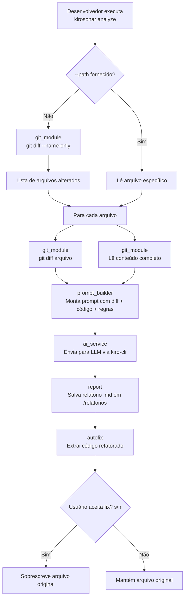

# KiroSonar

Code Review Inteligente e Auto-Fix com IA diretamente no seu terminal. O KiroSonar é uma CLI nativa em Python que atua como um "SonarQube tunado com IA", operando sob a filosofia *"Clean as You Code"*. Em vez de apenas apontar erros em um dashboard web, ele analisa o seu `git diff`, envia para uma LLM avaliar com base nas regras da sua empresa e aplica a refatoração automaticamente no seu código.

---

## Arquitetura



### Estrutura de Módulos

```
backend/src/
├── cli.py            # Ponto de entrada, orquestra o fluxo completo
├── config.py         # Carrega regras de análise (arquivo, specs ou default)
├── git_module.py     # Integração com Git (diff, arquivos alterados)
├── ai_service.py     # Chamada à LLM via kiro-cli (subprocess + barra de progresso)
├── prompt_builder.py # Montagem do prompt estruturado para a LLM
├── report.py         # Geração e salvamento de relatórios Markdown
├── autofix.py        # Extração e aplicação do código refatorado
└── chunker.py        # Divisão de arquivos grandes em trechos por função/classe
```

---

## Sumário de Documentações

- [RFC 001: Arquitetura MVP](./backend/docs/RFC-001-KiroSonar-MVP.md)
- [Tickets de Desenvolvimento](./backend/docs/tickets/)
- [User Stories](./backend/docs/user-stories/)
- [Code Reviews](./backend/docs/code-review/)

---

## Tecnologias Utilizadas

- Python 3.11+
- Bibliotecas nativas (Standard Library): `argparse`, `subprocess`, `os`, `re`, `sys`
- Git (para captura de diffs)
- LLM via `kiro-cli` (IA local/remota)
- Setuptools (empacotamento via `pyproject.toml`)
- Conda (gerenciamento de ambiente)

---

## Instruções de Instalação e Uso

### Pré-requisitos

- Python 3.11 ou superior
- Git instalado
- Binário `kiro-cli` disponível no PATH

### Instalação

```bash
pip install KiroSonar
```

### Configuração do Ambiente de Desenvolvimento

```bash
conda create -n kirosonar python=3.11 -y
conda activate kirosonar
pip install -e ".[dev]"
```

### Usando com Docker (recomendado)

Não precisa instalar Python, dependências ou configurar nada. Só precisa do Docker.

```bash
# Build da imagem (uma vez só)
cd backend
docker build -t kirosonar:latest .

# Analisar um arquivo específico do seu projeto
docker run --rm -it -v "$(pwd):/project" -w /project kirosonar:latest analyze --path src/meu_arquivo.js

# Analisar arquivos alterados via git diff
docker run --rm -it -v "$(pwd):/project" -w /project kirosonar:latest analyze

# Usar regras customizadas
docker run --rm -it -v "$(pwd):/project" -w /project kirosonar:latest analyze --rules regras_empresa.md

# Listar relatórios gerados
docker run --rm -v "$(pwd):/project" -w /project kirosonar:latest report
```

> **Flags importantes:**
> - `-it` é obrigatório para os comandos de análise. Sem ele, o prompt interativo do auto-fix ("Deseja aplicar o fix? s/n") não funciona e o container encerra com erro `EOFError`. Para comandos não-interativos como `report`, o `-it` é opcional.
> - `-v "$(pwd):/project"` monta o diretório atual dentro do container.
> - `-w /project` define o diretório de trabalho.
>
> Por padrão, o mock da LLM está ativado (`KIROSONAR_MOCK=1`). Para usar a LLM real, passe `-e KIROSONAR_MOCK=0` e monte o binário `kiro-cli` no container.

### Uso

```bash
# Analisa automaticamente todos os arquivos alterados no repositório local
kirosonar analyze

# Analisa um arquivo específico, ignorando o git diff
kirosonar analyze --path src/meu_arquivo.py

# Especifica um arquivo de regras customizado
kirosonar analyze --rules caminho/para/regras.md

# Cria regras_empresa.md a partir do template (se não houver specs no projeto)
kirosonar init

# Lista os relatórios gerados
kirosonar report
```

### Regras Personalizadas

O KiroSonar detecta regras de análise automaticamente nesta ordem de prioridade:

1. `--rules caminho` (flag explícita, sempre vence)
2. `regras_empresa.md` na raiz do projeto
3. Specs de IA existentes (`.kiro/instructions.md`, `.cursor/rules`, `.github/copilot-instructions.md`)
4. `DEFAULT_RULES` (fallback com regras genéricas)

O repositório inclui um template de regras em `regras_empresa.example.md` com seções de Padrões de Código, Nomenclatura, Arquitetura e Segurança. Para usar:

```bash
# Copie o template e adapte às convenções do seu time
cp regras_empresa.example.md regras_empresa.md
```

Ou use o comando `init` que cria o arquivo automaticamente (se não houver specs no projeto):

```bash
kirosonar init
```

---

## Variáveis de Ambiente

| Variável | Descrição | Valores | Default |
|---|---|---|---|
| `KIROSONAR_MOCK` | Ativa mock da LLM para testes offline | `1` (mock) / `0` (real) | `0` (real) |

Copie o arquivo de exemplo e ajuste conforme necessário:

```bash
cp backend/.env.example backend/.env
```

> O arquivo `.env` está listado no `.gitignore` e nunca será commitado no repositório.

---

## Fluxo de Dados

1. O usuário executa `kirosonar analyze` (com ou sem `--path`)
2. O módulo `git_module` descobre arquivos alterados via `git diff --name-only`
3. Para cada arquivo, captura o diff e o conteúdo completo
4. O `prompt_builder` monta um prompt estruturado com diff (peso máximo), código completo (peso médio) e regras da empresa
5. Arquivos grandes sem diff (>300 linhas) são divididos em trechos pelo `chunker` e analisados em paralelo
6. O `ai_service` envia o prompt para a LLM via `kiro-cli` (subprocess com timeout de 120s e barra de progresso)
7. A resposta é salva como relatório Markdown em `/relatorios`
8. O `autofix` extrai código refatorado (entre tags `[START]`/`[END]`) e oferece aplicação interativa

---

## Troubleshooting

**"Erro: o diretório atual não é um repositório Git válido."**
Certifique-se de estar na raiz de um repositório Git inicializado (`git init`).

**"Erro: KiroSonar requer Python 3.11 ou superior."**
Verifique sua versão com `python3 --version`. Use `conda` ou `pyenv` para instalar a versão correta.

**"Timeout: kiro-cli não respondeu em 120 segundos."**
Verifique se o `kiro-cli` está instalado e acessível no PATH. Teste com `kiro-cli --version`.

**"Nenhum arquivo alterado encontrado."**
Isso significa que `git diff --name-only` não retornou nada. Verifique se há alterações não commitadas com `git status`. Alternativamente, use `--path` para analisar um arquivo específico.

**"Nenhum código refatorado encontrado na resposta da IA."**
A LLM não retornou código entre as tags `[START]`/`[END]`. Isso pode acontecer se a IA não encontrou necessidade de refatoração ou se o prompt foi muito grande.

---

## Integrantes do Grupo 5

- Lucas Braga
- Lucas Heideric
- Matheus Costa
- Matheus Gomes
- Pedro Lima
- Weslley