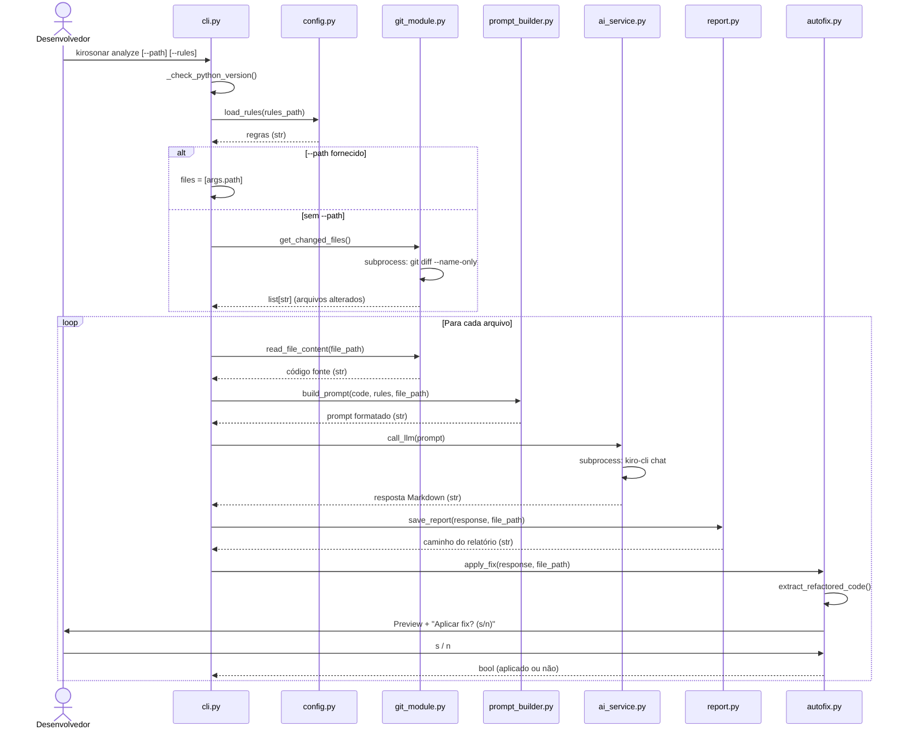
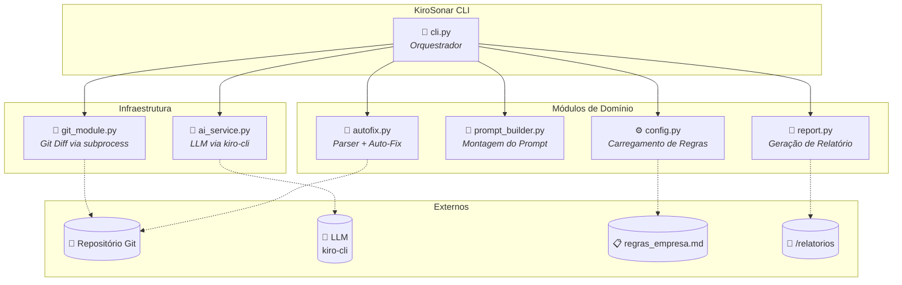

# 🚀 KiroSonar
**Code Review Inteligente e Auto-Fix diretamente no seu terminal.**

O **KiroSonar** é uma CLI nativa em Python que eleva a análise estática de código a um novo patamar. Ele atua como um "SonarQube tunado com IA", operando sob a filosofia *"Clean as You Code"*. Em vez de apenas apontar erros em um dashboard web, ele analisa o seu `git diff`, envia para uma LLM avaliar com base nas regras da sua empresa e aplica a refatoração automaticamente no seu código.

---

## 🎯 Por que o KiroSonar? (Prós x Contras)

A esteira tradicional de análise de código gera atrito. Nós resolvemos isso trazendo a solução para o terminal do desenvolvedor.

| Critério | Esteira Tradicional (ex: SonarQube) | KiroSonar (Nossa Abordagem) |
| :--- | :--- | :--- |
| **Atuação** | Passiva (Apenas aponta o erro) | **Proativa** (Sugere e aplica o Auto-Fix) |
| **Fricção (DX)** | Alta (Exige sair da IDE e abrir dashboard web) | **Zero** (Tudo acontece no terminal local) |
| **Escopo** | Analisa a branch inteira (demorado) | Foco estrito no **Git Diff** (rápido e barato) |
| **Regras** | Rígidas e difíceis de customizar | **Flexíveis**, escritas em linguagem natural (.md) |
| **Custo Computacional**| Requer servidor rodando 24/7 (Java/DB) | CLI efêmera, nativa e leve (Python Standard Lib) |

---

## 🏗️ Arquitetura e Fluxo de Funcionamento

O KiroSonar foi desenhado usando Clean Architecture e módulos 100% desacoplados.

1. **Input:** O dev roda `kirosonar analyze`.
2. **Descoberta:** O módulo de infraestrutura roda `git diff` e coleta apenas os arquivos alterados.
3. **Prompt Builder:** O código alterado é envelopado junto com o arquivo `regras_empresa.md`.
4. **AI Service:** O prompt é enviado via subprocesso para o `kiro-cli` (LLM local/remota).
5. **Report Generation:** A IA devolve uma auditoria (Bugs, Vulnerabilidades, Code Smells) salva na pasta `/relatorios`.
6. **Auto-Fix (Parser):** A CLI extrai o código refatorado da resposta da IA e pergunta no terminal se você deseja sobrescrever o arquivo original `(s/n)`.

### Diagrama de Sequência (UML)

### Diagrama de Componentes (UML)

---

## 📋 User Stories

### US-01: Análise automática dos arquivos alterados via Git Diff

> **Como** desenvolvedor que trabalha em um repositório Git,
> **eu quero** executar `kirosonar analyze` no terminal
> **para que** apenas os arquivos que eu modifiquei sejam analisados automaticamente pela IA, sem precisar indicar cada arquivo manualmente.

**Critérios de Aceite:**
- Ao rodar `kirosonar analyze` dentro de um repositório Git, o sistema executa `git diff --name-only` e identifica os arquivos alterados.
- Para cada arquivo alterado, o código é lido, combinado com as regras da empresa e enviado à LLM.
- Um relatório em Markdown é gerado na pasta `relatorios/` com as seções: Bugs, Vulnerabilidades, Code Smells e Hotspots de Segurança.
- Se não houver arquivos alterados, o sistema exibe a mensagem "Nenhum arquivo alterado encontrado." e encerra sem erro.
- Se o diretório não for um repositório Git, o sistema exibe mensagem de erro e encerra com código 1.

---

### US-02: Aplicação interativa de Auto-Fix sugerido pela IA

> **Como** desenvolvedor que recebeu sugestões de refatoração da IA,
> **eu quero** visualizar um preview do código refatorado e decidir se aplico ou não a correção
> **para que** eu mantenha controle total sobre as alterações no meu código, evitando sobrescritas indesejadas.

**Critérios de Aceite:**
- Após a análise, se a resposta da IA contiver código refatorado entre as tags `[START]` e `[END]`, o sistema exibe um preview das primeiras 20 linhas no terminal.
- O sistema pergunta interativamente: "Deseja aplicar o fix em '<arquivo>'? (s/n)".
- Se o usuário digitar `s` ou `S`, o arquivo original é sobrescrito com o código refatorado.
- Se o usuário digitar qualquer outra coisa, o fix não é aplicado e o sistema informa "Fix não aplicado."
- Se a resposta da IA não contiver as tags `[START]`/`[END]`, o sistema informa que não há código refatorado e segue sem erro.

---

### US-03: Personalização das regras de análise por projeto

> **Como** tech lead de um time de desenvolvimento,
> **eu quero** criar um arquivo `regras_empresa.md` com as diretrizes de código do meu time
> **para que** a IA avalie o código com base nos padrões específicos da minha organização, e não apenas em boas práticas genéricas.

**Critérios de Aceite:**
- Se existir um arquivo `regras_empresa.md` na raiz do projeto, o sistema carrega seu conteúdo e injeta no prompt enviado à LLM.
- Se o arquivo não existir, o sistema utiliza um conjunto de regras padrão (DEFAULT_RULES) como fallback, sem interromper a execução.
- O usuário pode especificar um caminho alternativo para o arquivo de regras via `--rules <caminho>`.
- As regras são escritas em linguagem natural (Markdown), permitindo que qualquer membro do time as edite sem conhecimento técnico avançado.

---

## 💻 Guia do Usuário (Como Usar no Dia a Dia)

### Instalação Básica
Para instalar a ferramenta na sua máquina (requer Python 3.11+ e o binário `kiro-cli` no PATH):

    pip install KiroSonar

### Comandos

Vá até a pasta do seu projeto de software e execute:

    # Analisa automaticamente todos os arquivos alterados no seu repositório local
    kirosonar analyze

    # Analisa um arquivo específico, ignorando o git diff
    kirosonar analyze --path src/meu_arquivo.py

### Injetando as Regras da sua Empresa

Crie um arquivo chamado `regras_empresa.md` na raiz do seu projeto. O KiroSonar lerá esse arquivo automaticamente e forçará a IA a julgar o seu código com base nas diretrizes do seu time.

---

## 🛠️ Guia para Desenvolvedores (Contribuindo com o Projeto)

Se você faz parte da equipe de engenharia do KiroSonar, utilizamos **Conda** para garantir a padronização do ambiente (evitando o clássico "na minha máquina funciona").

### 1. Configurando o Ambiente Isolado

Na raiz deste repositório, execute:

    conda create -n kirosonar python=3.11 -y
    conda activate kirosonar

### 2. Instalando em Modo de Desenvolvimento

Para que o comando reflita as mudanças no código em tempo real:

    pip install -e .

### 3. Documentação Interna

Para entender a fundo o escopo do MVP e o planejamento das Tarefas (Kanban), consulte:

- [RFC 001: Arquitetura MVP](./docs/RFC-001-KiroSonar-MVP.md)
- [Tickets de Desenvolvimento](./docs/tickets/)
